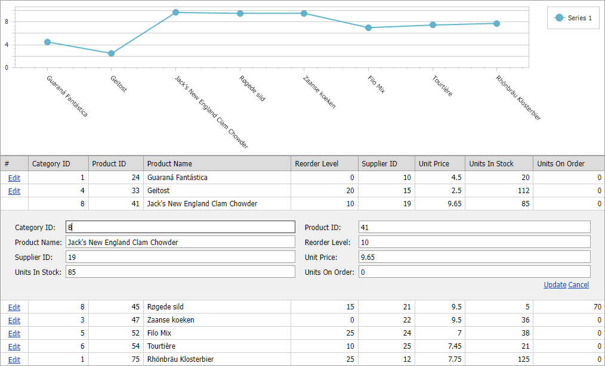

<!-- default badges list -->

<!-- default badges end -->
<!-- default file list -->

<!-- default file list end -->
# WebForms - How to Update a WebChartControl According to the Changes Made to an ASPxGridView
<!-- run online -->
**[[Run Online]](https://codecentral.devexpress.com/e1277/)**
<!-- run online end -->
This example demonstrates how to update a `WebChartControl` based on the edited data in an `ASPxGridView`.

[WebChartControl](https://docs.devexpress.com/AspNet/DevExpress.XtraCharts.Web.WebChartControl) is updated with the [ASPxClientWebChartControl.PerformCallback()](https://docs.devexpress.com/AspNet/js-ASPxClientWebChartControl.PerformCallback(args)) method called from the `ASPxClientGridView.EndCallback` event handler.

## Files to Review

* [Products.cs](./CS/WebSite/App_Code/Products.cs) (VB: [Products.vb](./VB/WebSite/App_Code/Products.vb))
* [Default.aspx](./CS/WebSite/Default.aspx) (VB: [Default.aspx](./VB/WebSite/Default.aspx))
* [Default.aspx.cs](./CS/WebSite/Default.aspx.cs) (VB: [Default.aspx.vb](./VB/WebSite/Default.aspx.vb))
* [Global.asax](./CS/WebSite/Global.asax) (VB: [Global.asax](./VB/WebSite/Global.asax))
